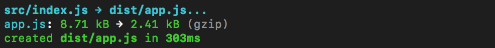

# rollup-plugin-files-size

[](https://travis-ci.com/vladshcherbin/rollup-plugin-files-size)
[](https://codecov.io/gh/vladshcherbin/rollup-plugin-files-size)

Show your bundle files size.



## Installation

```bash
# yarn
yarn add rollup-plugin-files-size -D

# npm
npm install rollup-plugin-files-size -D
```

## Usage

```js
// rollup.config.mjs
import filesSize from 'rollup-plugin-files-size'

export default {
  input: 'src/app.js',
  output: {
    file: 'dist/app.js',
    format: 'iife'
  },
  plugins: [
    filesSize()
  ]
}
```

## License

MIT
